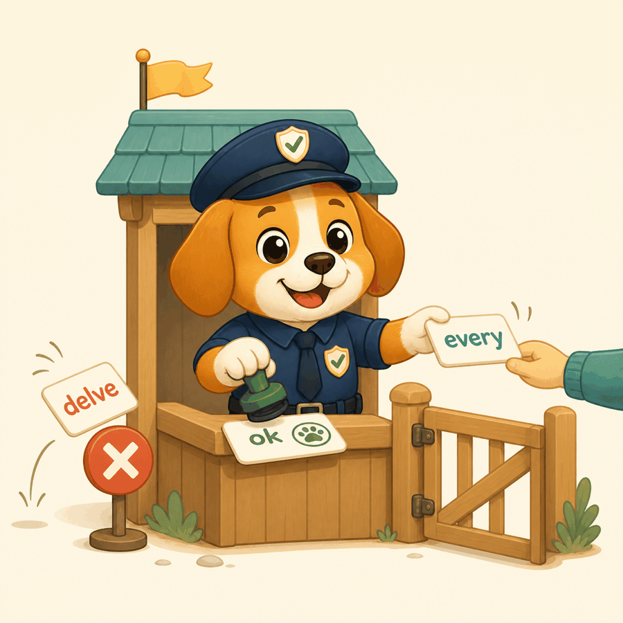

# vocabguard

<p align="center">
  
</p>

A [Pydantic AI](https://ai.pydantic.dev) capability that watches an agent's tool calls and
responses, scores the prose in them against a per-repo watchlist of model-favored terms, and
returns a `ModelRetry` naming the terms and preferred replacements so the model rephrases before
the text lands anywhere.

It ships with a classifier measured from real corpora, and a CLI that scores text with it, builds
your own watchlist from your repository's history, runs the same check as a pre-commit hook, and
reports drift over time.

## The whole thing in one file

A triage agent that files a ticket and writes notes to disk. The guard watches the ticket's
`summary`, the text every `edit_file` call writes, and any plain-text reply. When one of those
drifts, a second, smaller model rewrites it in plain sentences before it lands; the triage model
never sees a retry.

```python
from pathlib import Path

from pydantic import BaseModel
from pydantic_ai import Agent

from vocabguard import OutputField, TextOutput, ToolArgument, VocabularyGuard


class CaseTicket(BaseModel):
    summary: str
    priority: int


def edit_file(path: str, content: str) -> str:
    """Write a file under docs/."""
    target = Path(path)
    target.parent.mkdir(parents=True, exist_ok=True)
    target.write_text(content)
    return f'wrote {path}'


guard = VocabularyGuard(
    rewriter='openai:gpt-5.6-luna',
    targets=[
        OutputField(CaseTicket, lambda ticket: ticket.summary),  # a field of the structured output
        ToolArgument(edit_file, 'content'),  # an argument of a tool call
        TextOutput(),  # the final text, when the agent answers in prose instead
    ],
    on_hit=lambda report: print(report.describe()),
)

# The agent files a ticket, or replies in text when there is nothing to file.
agent = Agent(
    'openai:gpt-5.6-luna',
    output_type=[CaseTicket, str],
    instructions='Triage bug reports. Write your working notes to docs/triage/<slug>.md, then file a ticket.',
    tools=[edit_file],
    capabilities=[guard],
)

result = agent.run_sync(
    'Bug report: exporting a project with more than 200 assets hangs the desktop app at 97%. '
    'Reproducible on macOS and Windows since 3.4.1. Three customers affected, one enterprise.'
)
print(result.output)
```

What happens on a run where the model drifts:

1. The model calls `edit_file('docs/triage/export-hang.md', ...)`. The guard scores `content` as
   markdown, and a note in the usual 2026 register comes back around 1.8 against a threshold of
   0.41: `full`, `every`, `across`, `no`. `on_hit` prints the report. The rewriter is handed the text and the terms, its reply is
   scored again and passes, and the file is written with the rewritten content. The tool returns
   `wrote docs/triage/export-hang.md` as if nothing happened.
2. The model files `CaseTicket(summary=..., priority=1)`. `summary` scores clean, so the output is
   returned untouched.
3. If the model had answered in prose instead, `TextOutput()` would have scored that reply the same
   way.

Every piece of that is optional. `VocabularyGuard()` with no arguments watches every tool call
and every response with the bundled classifier and asks the model itself to rephrase.

## Sixty seconds, no code

```bash
uvx vocabguard "Agent runtime with persistent memory across sessions. Every task runs in a worker."
echo "Some text you are unsure about" | uvx vocabguard
```

No install step: `uvx` fetches the package and runs it. Both forms print the score, the terms
that drove it, and `drifted` or `ok`, and exit 1 on drift.

Where the classifier came from, and what it can and cannot tell you, is under
[Measured README watchlist](#measured-readme-watchlist). Read the constraints first.

## Constraints

Read these before the examples; they shape how the guard behaves.

- **Prose only.** Markdown, reStructuredText, and plain text are scored after fenced code, inline
  code, URLs, HTML tags, and link targets are stripped. Python files contribute docstrings and
  comments only; identifiers are never scored. A tool call that names a file of any other type
  (`.json`, `.yaml`) is not prose and goes through untouched.
- **Three places text is scored.** Tool calls that carry a path are scored as that file type.
  Tool calls without a path (a chat message, a search query, a shell command) have every string
  argument scored as plain text. Every model response has its text scored, whether it is the final
  answer or a sentence written next to a tool call. Each can be narrowed with `tools` and
  `output`.
- **Term substitution only.** The guard catches words and two-word phrases. It does not see
  sentence structure, hedging, or list-heavy layouts. That is the job of the `[structural]` extra,
  which is not part of this release.
- **Added lines only, when it can tell.** If a tool call carries the previous text
  (`old_string`), only the lines the edit introduces are scored. Scoring the whole file would block
  every edit to a file that already contains watched terms.
- **A minimum size.** Below `min_tokens` (default 20 unigrams plus bigrams) the score is skipped,
  because a five-word edit cannot be judged by frequency. Banned patterns still fire.
- **One tokenizer everywhere.** Baseline, corpus, watchlist keys, and the text under test all go
  through the same lowercase, lemmatize, unigram-plus-bigram pipeline. Hand-written watchlist keys
  are normalized on load, so `noting` and `note` are the same term.
- **No model requests from the guard, unless you ask for them.** One command talks to a model:
  `vocabguard rewrite`. The capability itself does no I/O, with one opt-in exception: a
  `rewriter` is a second agent, and it is called only when a hit fires at a site you named in
  `targets`.
- **git is required for the CLI.** `baseline`, `rewrite`, `report`, and `check --diff-base` shell
  out to `git`; there is no git library dependency.
- **Python 3.11 or later.** Dependencies are `pydantic-ai-slim`, `httpx`, and `simplemma`, a
  pure-Python lemmatizer with no model download.

## Install

```bash
pip install vocabguard
# or
uv add vocabguard
```

## How the watchlist is built

Two corpora are compared: the prose already in your repository at some ref (the baseline) and a
model's rewrite of that same prose (the model corpus). For every unigram and bigram, the log-odds
ratio between the two corpora is computed with an informative Dirichlet prior (Monroe, Colaresi,
and Quinn, 2008), where the prior mass for each term is `alpha0` times its pooled frequency. The
prior pulls common words toward zero, which is why stopwords are not removed. Each log-odds value
is divided by its standard error to give a z score; terms with z above a cutoff toward the model
corpus are candidates. Each candidate's z is then weighted by how evenly it spreads across
documents (documents containing it over total occurrences): a word used once in most documents
keeps its weight, a word used forty times in a few documents loses most of it. Voice spreads and
topic bursts, so the weighting favours how things are said over what they are about. The
highest weighted terms become the watchlist. At write time, the score of a piece of prose is the
sum of the weighted z of the watched terms it contains divided by its token count, and any score
above the threshold asks the model to rephrase.

## Workflow

### 1. Decide what "our voice" is

The baseline is prose you would be happy to have more of. Two ways to get it:

**Your own history.** Pick a ref from before agents started writing in the repo, and restrict to
prose directories if the repo has vendored text you do not want in the sample:

```bash
vocabguard baseline --ref v1.0.0 --path docs --path README.md -o baseline.json
```

**A directory of reference prose.** If the repo is new, or its history is already model-written,
point `baseline` at a folder of documents you would like to sound like (READMEs from projects you
admire, a docs site, anything written before agents were writing):

```bash
vocabguard baseline --dir reference/ -o baseline.json
```

Either way the file is frozen once written; pass `--force` to replace it. Changing the baseline
silently would change what every later report means.

### 2. Build the model corpus

```bash
vocabguard rewrite --ref v1.0.0 --path docs --path README.md --model openai:gpt-5.6-luna -o corpus/
```

`--dir reference/` works here too when the baseline came from a gathered corpus.

Each prose document at the ref is sent to the model with the instruction to rewrite it in its own
words at the same length. Output lands at `corpus/<original path>.md`. Files that already exist
are skipped, so an interrupted run can be resumed. This is the only step that costs tokens.

### 3. Contrast the two

```bash
vocabguard contrast --baseline baseline.json --corpus corpus/ -o watchlist.json --alpha0 500 --z 2.5
```

Replacements and banned patterns are hand-maintained in a separate file so re-running `contrast`
never loses them:

```bash
vocabguard contrast --baseline baseline.json --corpus corpus/ -o watchlist.json --curated curated.json
```

```json
{
  "replacements": {"leverage": "use"},
  "banned_patterns": ["\u2014"]
}
```

With corpora of millions of tokens nearly every n-gram clears `--z 2.5`, so cap the list with
`--top 1000` and let `evaluate` pick the threshold.

### 3b. Grade the watchlist before wiring it in

```bash
vocabguard evaluate --baseline-dir human/ --corpus-dir model/ --top 1000
```

`evaluate` builds the watchlist on 80% of each corpus, scores the other 20% with the same scorer the
guard uses, and prints the AUC plus the threshold that best balances catches against false alarms.
Bake that threshold into the file with `contrast --threshold`; the capability and `check` read it
from there. A threshold of `0.0` with a thousand-term list would fire on almost anything.

### 4. Wire the capability

```python
from pydantic_ai import Agent

from vocabguard import VocabularyGuard, Watchlist

guard = VocabularyGuard(Watchlist.load('watchlist.json'))
agent = Agent('openai:gpt-5.6-luna', capabilities=[guard])
```

`VocabularyGuard()` with no watchlist uses the bundled measured classifier. The threshold comes
from the watchlist unless you pass one. By default every tool call and every model response is scored. A tool call is treated as a file
write when it has a `path` or `file_path` argument; the new text is read from `content`,
`new_string`, or `new_str`, and the previous text from `old_string` or `old_str`. All of these
key names are configurable. With `instruct=True` (the default) the top 15 watched terms and their
replacements are added to the system prompt so the model avoids them before the guard has to fire.

```python
guard = VocabularyGuard(
    Watchlist.load('watchlist.json'),
    tools=lambda name: name.endswith('_file'),  # or a sequence of names; None watches every tool
    output=False,  # leave model responses alone, score tool calls only
    threshold=0.05,
    mode='warn',
    on_hit=lambda report: print(report.describe()),
)
```

Three modes decide what a hit above threshold does:

- **`retry`** raises `ModelRetry` before the tool runs. For a tool call, the model is asked to
  resubmit the same call with the wording fixed; for a response, to reply again. The message
  lists the terms, their z scores, and replacements.
- **`nudge`** lets the tool run, then appends the report to the tool result with a suggestion to
  rewrite. The model decides. Model output cannot be nudged (there is no result to attach to), so
  it is treated as `warn`.
- **`warn`** lets everything through.

`on_hit` is called on every hit in every mode, so you can wire it to your own logging or
metrics; `HitReport.source` says which tool call, field, or response it came from.

Misconfiguration (an unknown mode, an empty `tools` sequence, a negative threshold, a rewriter
without targets, an output field that does not exist) raises `UserError` at construction, not
when the first tool call arrives.

### 4b. Name the sites, and let a second agent do the rewriting

`targets` says exactly where the guard looks, and `rewriter` is a second agent that rewrites
what fires there, so the primary model never sees a retry. The rewritten text is scored again;
only if it still drifts does `mode` apply.

```python
from pydantic import BaseModel

from vocabguard import OutputField, TextOutput, ToolArgument, VocabularyGuard


class CaseTicket(BaseModel):
    summary: str
    priority: int


def edit_file(path: str, content: str) -> str: ...


guard = VocabularyGuard(
    rewriter='openai:gpt-5.6-luna',
    targets=[
        OutputField(CaseTicket, lambda ticket: ticket.summary),  # a field of the structured output
        ToolArgument(edit_file, 'content'),  # an argument of a tool call
        TextOutput(),  # the final text of the run
    ],
)
```

The targets take references so mistakes surface early. `OutputField` takes the output class and a
selector; the type checker verifies `ticket.summary` exists, and at construction the selector is
resolved to the field name (pydantic models and dataclasses). `ToolArgument` takes the tool
function and checks the argument against its signature, including that it is annotated `str`.
Both also accept plain strings, `OutputField(CaseTicket, 'summary')` and
`ToolArgument('edit_file', 'content')`, for tools that have no Python function behind them.

A model name or instance gets the bundled rewrite instructions (plain sentences addressed to a
reader, same content, same length, code and markup untouched). Pass your own `Agent[None, str]`
to control the instructions. With `targets` set, `tools` and `output` are ignored; only the
named sites are scored. Python file content is never sent to a rewriter, since a rewritten
docstring is one indentation away from a syntax error; those hits follow `mode` instead.

### 5. Run the same check in pre-commit

```yaml
repos:
  - repo: https://github.com/mpfaffenberger/vocabguard
    rev: v0.3.0
    hooks:
      - id: vocabguard
        args: [--watchlist, watchlist.json, --diff-base, origin/main]
```

`vocabguard check` accepts files and directories, exits nonzero on hits above threshold, and prints
the same report the guard sends to the model. Without `--watchlist` it uses the bundled measured
classifier, and without `--threshold` it uses the threshold stored in the watchlist.

### 6. Watch drift over time

```bash
vocabguard report --baseline baseline.json --watchlist watchlist.json --since v1.0.0 --format csv
```

For every commit after the ref, the report gives the Jensen-Shannon divergence between the
commit's added prose and the baseline, plus watchlist hits per thousand words. The guard never
computes divergence; this is the monitor, not the gate. Small commits have few tokens and noisy
divergence, so read the `words` column alongside it.

## Starter watchlist

`Watchlist.starter()` (`vocabguard/data/starter_watchlist.json` on the command line) is a short
hand-curated list of commonly model-favored terms such as `delve`,
`leverage`, `robust`, `seamless`, and `worth noting`, with modest z values and replacements. It is
a starting point, not a measurement; `contrast` on your own history will disagree with it in both
directions.

## Measured README watchlist

`Watchlist.default()` is a measurement, and it is what `VocabularyGuard()`, `vocabguard score`,
and `vocabguard check` use when given nothing else. It was built with the commands above from two
corpora of GitHub READMEs: 4,319 from repositories with at least 500 stars whose last push was
before 2025 (22 languages, weighted toward TypeScript, Python, Java, Rust, Go, JavaScript, and C;
6.4M prose tokens), and 1,047 from repositories with Claude Code commits during 2026 (2.1M prose
tokens). Markup, URLs, and code were stripped before counting.

```bash
vocabguard evaluate --baseline-dir human/ --corpus-dir claude/ --top 1000
vocabguard contrast --baseline human.json --corpus claude/ -o readme_2026_watchlist.json --top 1000 --threshold 0.41
```

```text
AUC: 0.869
threshold 0.41: flags 75% of model documents and 6% of baseline documents
```

The 0.41 is stored in the file. What it measures, and what it does not:

- **Voice, by design.** The list is led by `full`, `every`, `across`, `stay`, `live`, `ship`,
  `never`, `plus`, `no`: the 2026 corpus over-uses them and under-uses `the`, `of`, `to`, `you`,
  `can`, `will`, `be`, `if`. Nominal, list-shaped fragments instead of sentences aimed at a
  reader. Without the evenness weighting the same corpora put `agent`, `memory`, `session`, and
  `skill` on top, with the same AUC; those are what 2026 repositories are about, not how they are
  written, and more people writing about agents is not drift. The weighting drops `agent` from a
  z of 77 to 5.
- **Topic still leaks a little.** A human writing about an agent in plain sentences lands right at
  the cut; the test suite pins that case rather than hiding it. Documents about agents will run a
  few tenths higher than documents about parsers.
- **Scaffold headers are the next frontier.** Push the weighting past 1.5 and the list becomes
  `quick start`, `license mit`, `project structure`, `prerequisite`: every generated README has
  exactly one of each. That is structural drift, the job of the `[structural]` extra.
- **Attribution is per repository, not per document.** Some READMEs in the 2026 corpus were typed
  by people; some pre-2025 READMEs were not. The 6% false alarm rate was measured on pre-2025
  READMEs.
- **English only.** The 2026 corpus has more non-English READMEs, so some non-English function
  words carry weight. Non-English prose scores high for the wrong reason.

The corpora are not in the repository. This README scores 0.77 against its own classifier, well
above the cut, and the terms responsible are `every`, `no`, `never`, `what it`, and `across`, not
the subject matter. It was written by a model.

## Watchlist file

```json
{
  "terms": {"delve": 6.0, "worth noting": 5.0},
  "replacements": {"delve": "look at, examine"},
  "banned_patterns": ["\u2014"]
}
```

`terms` maps an n-gram to its z score. `replacements` is optional and hand-maintained.
`banned_patterns` is an optional list of regular expressions that always count as a hit, whatever
the score or token count.

## Development

```bash
uv sync
uv run ruff format --check . && uv run ruff check . && uv run pyright && uv run pytest
uv run vocabguard check README.md docs/ --watchlist vocabguard/data/starter_watchlist.json
```

The last line is the package checking its own prose, and CI runs it.
